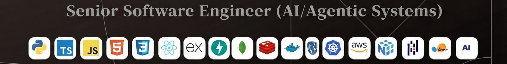

<!-- HEADER ANIMATION -->
<h1 align="center">Hi 👋, My Name's Tahmina Akter</h1>

  

I'm a Senior Software Engineer focused on building production software across AI agents, backend systems, APIs, and distributed services.

Currently, I'm working on agentic AI systems that can use tools, call enterprise APIs, coordinate multi-step workflows, and take real actions—not just generate responses.

I enjoy working at the intersection of software engineering and AI, especially turning LLM capabilities into reliable, observable, production-ready systems.

---

## 🧠 Tech Stack

### 💻 Languages

---

### 🤖 AI / LLMs

---

### ⚙️ Backend

---

### 🎨 Frontend

---

### 🗄️ Databases

---

### 🔥 Infrastructure & Architecture

**Architecture & Engineering:** `Microservices` · `System Design` · `Async Programming`
---

### AI / ML

**LLM & Generative AI**

**AI Agents**

**AI Observability**

**ML & Data**

---

### Integration & Engineering

**Architecture & Integrations:** `Enterprise API Integrations` · `Solution Architecture`
---

### Version Control

---

### Languages
🇺🇸 English · 🇧🇩 Bengali · 🇮🇳 Hindi · 🇵🇰 Urdu

- ### 🚀 What I'm Building Toward

**Senior AI Engineer · AI Agent Engineer · Senior Software Engineer · Applied AI · LLM Applications · Distributed Systems**

> I build software that doesn't just respond — **it takes action.**
>
> From AI agents that orchestrate tools and APIs to backend systems that handle complex workflows, I'm interested in turning **LLMs into reliable, production-ready software** that can reason, collaborate with other systems, and get real work done.
---

🌎 Let's Connect
💼 LinkedIn: linkedin.com/in/techtahus
💻 GitHub: github.com/tahmina-official
📧 Email: tahmina.usa24@gmail.com

---

      

